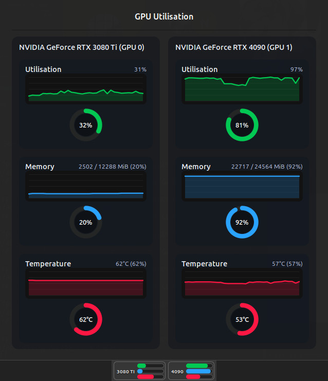

# gpuusage_cinamon

## (gpuusage_cinamon)

* Description: Cinamon Applet that monitors NVIDIA GPU usage
* Copyright: AXISFX LTD
* Author: Ewan Davidson
* Email: ewan@axisfx.design
* Release Date: 27.10.2025
* Current Version: 1.0

## Features

* Panel gauges mirror the KDE widget with GPU (green), VRAM (blue) and temperature (red) rings per device
* Supports rigs with multiple NVIDIA GPUs, rendering one gauge per board
* Click to view a detailed popup with utilisation, memory and temperature readouts
* Refresh interval (default 1 second) and ring visibility configurable from Cinnamon's applet settings

<!--  -->

## Negative Features

* Coded with AI (I'm not learning qml or javascript)
* Tested only on Cinamon version 6.0.4

## Dependencies

* nvidia-smi
* Cinamon version 6.0.4

## Installation

1. Copy this folder to `~/.local/share/cinnamon/applets/gpuusage_cinamon@axisfx/` (create directories that do not exist yet).
2. Restart Cinnamon (`Alt`+`F2`, type `r`, press `Enter`) or log out and back in.
3. Open *Panel → Add applets to the panel*, search for **GPU Usage Monitor**, and add it to your panel.
4. Use the gear icon in the applet chooser to adjust the refresh interval or hide rings you do not need.

## Changes

### 1.0  |  27.10.2025

* Initial release
